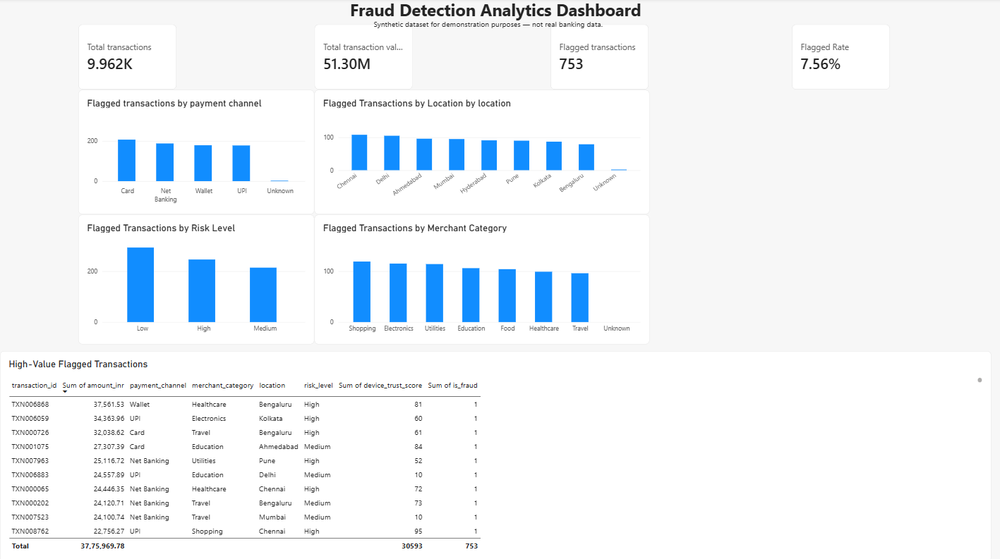

# Cloud-Native Fraud Detection Analytics Pipeline

## 📌 Project Overview

This project demonstrates an end-to-end fraud detection analytics pipeline using synthetic financial transaction data.

The pipeline covers data cleaning, cloud data warehousing, SQL analysis, and business intelligence visualization.

> **Disclaimer:** This project uses synthetic data for demonstration and portfolio purposes. It does not contain real banking or customer data and is not a production fraud detection system.

## 🏗️ Architecture

Synthetic Transactions  
↓  
Raw CSV  
↓  
Python + Pandas  
↓  
Data Cleaning  
↓  
Cleaned CSV  
↓  
Google BigQuery  
↓  
GoogleSQL Analysis  
↓  
Power BI Dashboard  
↓  
Business Insights

## 🎯 Business Questions

- How many transactions were processed?
- What was the total transaction value?
- How many transactions were flagged?
- What percentage of transactions were flagged?
- Which payment channels had the most flagged transactions?
- Which locations had the most flagged transactions?
- Which risk levels had the highest flagged rates?
- Which merchant categories had the most flagged transactions?
- Which high-value flagged transactions should be reviewed first?

## 📊 Dataset

The dataset contains **10,000 synthetic financial transactions**.

Important fields include:

- Transaction ID
- Customer ID
- Merchant ID
- Transaction Timestamp
- Transaction Amount
- Payment Channel
- Merchant Category
- Location
- Device Type
- Failed Attempts
- Risk Level
- Transaction Status
- International Transaction Indicator
- Account Age
- Device Trust Score
- Fraud Flag

The raw dataset intentionally contains data-quality issues to demonstrate the data-cleaning process.

## 🧹 Data Cleaning

Python and Pandas were used to:

- Detect missing categorical values
- Replace missing categorical values with `Unknown`
- Detect and remove invalid timestamps
- Detect and remove negative transaction amounts
- Replace negative failed attempts with `0`
- Detect invalid device trust scores
- Replace invalid trust scores with the median valid score
- Detect and remove duplicate transaction IDs

### Cleaning Result

- Original records: **10,000**
- Cleaned records: **9,962**

## ☁️ Cloud Data Warehouse

The cleaned data was loaded into **Google BigQuery**.

BigQuery structure:

`fraud_detection.transactions`

GoogleSQL was used to analyze the transaction data.

## 🔎 SQL Analysis

The SQL analysis includes:

1. Total transaction count
2. Total transaction value
3. Flagged transaction count
4. Flagged transaction rate
5. Payment channel analysis
6. Location analysis
7. Risk-level analysis
8. Merchant-category analysis
9. High-value flagged transaction analysis

SQL file:

`sql/fraud_analysis.sql`

## 📈 Power BI Dashboard

The Power BI dashboard contains:

### KPI Cards

- Total Transactions
- Total Transaction Value
- Flagged Transactions
- Flagged Transaction Rate

### Charts

- Flagged Transactions by Payment Channel
- Flagged Transactions by Location
- Flagged Transactions by Risk Level
- Flagged Transactions by Merchant Category

### Detailed Table

- High-Value Flagged Transactions

Power BI report:

`dashboard/fraud_detection_dashboard.pbix`

## 📌 Key Results

| Metric | Result |
|---|---:|
| Total Transactions | 9,962 |
| Total Transaction Value | ₹51,295,766.49 |
| Flagged Transactions | 753 |
| Flagged Transaction Rate | 7.56% |

### Risk-Level Analysis

| Risk Level | Flagged Rate |
|---|---:|
| High | 24.60% |
| Medium | 7.63% |
| Low | 4.76% |

These results are based on the synthetic dataset and are intended for demonstration purposes.

## 🛠️ Technologies Used

- Python
- Pandas
- NumPy
- Google BigQuery
- GoogleSQL
- Microsoft Power BI
- Git
- GitHub

## 📁 Project Structure

```text
cloud-native-fraud-detection-analytics-pipeline/
│
├── data/
│   ├── financial_fraud_transactions_10000.csv
│   └── cleaned_fraud_transactions.csv
│
├── dashboard/
│   └── fraud_detection_dashboard.pbix
│
├── scripts/
│   ├── 01_load_data.py
│   └── 02_clean_data.py
│
├── sql/
│   └── fraud_analysis.sql
│
├── .gitignore
└── README.md
## Power BI Dashboard

